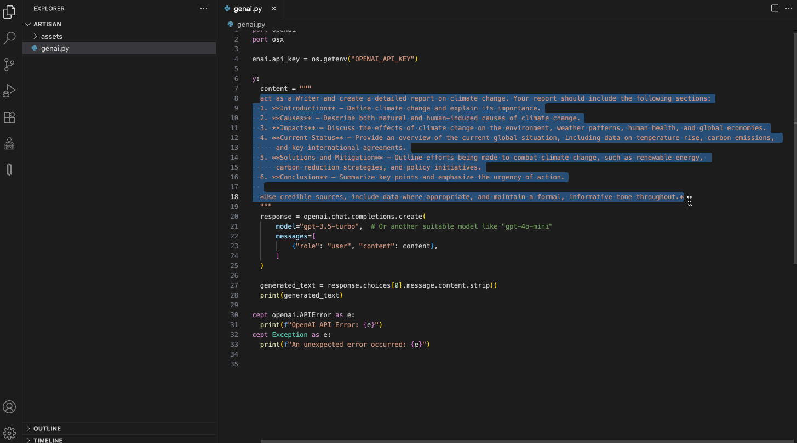

[](https://openexchange.intersystems.com/package/dc-artisan)

[](LICENSE)

# dc-artisan - Prompt & RAG Pipeline Toolkit for Developers

**dc-artisan** is a powerful VSCode extension integrated with an InterSystems IRIS backend. It provides developers with a suite of tools for prompt enhancement and building robust Retrieval-Augmented Generation (RAG) pipelines, streamlining the development of AI-powered applications.


This repository contains the source code for both the VSCode extension and the InterSystems IRIS backend.

## 🚀 Motivation

In the rapidly evolving landscape of Large Language Models (LLMs), developers need efficient tools to craft, test, and manage prompts and the complex data pipelines that feed them. `dc-artisan` was born out of the need for an integrated environment that brings prompt engineering and RAG pipeline management directly into the developer's primary workspace—VSCode. By leveraging the robust and high-performance data platform capabilities of InterSystems IRIS, `dc-artisan` offers a seamless and powerful solution for building the next generation of AI applications.

## 🛠️ How It Works

`dc-artisan` is composed of two main tools: **Prompt Enhance** and **RAG Pipeline Mode**.

### Prompt Enhance

This tool is designed to help you craft and test your prompts with precision.

* **Markdown-based Editing**: Write and structure your prompts using the familiar Markdown syntax.
* **Dynamic Variables**: Easily highlight variables using `{variable}` format (e.g., `{language}`, `{task}`).
* **Live Preview**: Input test values for your variables and instantly preview the final prompt with the substitutions applied.
* **Multi-Provider Testing**: Test your prompts against various LLM providers like OpenAI (ChatGPT), Anthropic (Claude), Google (Gemini), and more, thanks to the LiteLLM backend.
* **AI-Powered Suggestions**: Analyzes your prompt and asks clarifying questions to help you enrich and improve it.

### RAG Pipeline Mode

Manage the entire lifecycle of your RAG pipeline's knowledge base.

* **Document Management**:
  * Upload and embed new documents directly into the vector database.
  * Automatically extract text from common file formats like PDF, PPT, DOCX, and more.
* **Embedding Operations**:
  * Atomically view, update, and delete individual text chunks from your vector store.
  * Perform cost-efficient operations like copying entire documents or namespaces without the need to re-embed the content.
* **Multi-User Features**:
  * Full support for multi-user backend instances, allowing teams to collaborate seamlessly.
  * Includes user/session tracking and detailed audit logs for security and monitoring.

## 📋 Prerequisites

Before you begin, ensure you have the following installed:

* [Docker](https://www.docker.com/get-started) and [Docker Compose](https://docs.docker.com/compose/install/)
* [Visual Studio Code](https://code.visualstudio.com/)
* An API Key from at least one LLM provider (e.g., OpenAI, Anthropic, Cohere).

## 🛠️ Installation

The backend is containerized for easy setup. Follow these steps to get it running.

1.  **Clone the repository:**
    ```bash
    git clone [https://github.com/musketeers-br/dc-artisan.git](https://github.com/musketeers-br/dc-artisan.git)
    cd dc-artisan
    ```

2.  **Build the Docker container:**
    This command builds the necessary images for the application. The `--no-cache` flag ensures you are building from the latest source.
    ```bash
    docker-compose build --no-cache --progress=plain
    ```

3.  **Start the application:**
    This command starts the services in detached mode (`-d`).
    ```bash
    docker-compose up -d
    ```

4.  **Stop and remove containers (when done):**
    To stop the application and remove all associated containers, networks, and volumes.
    ```bash
    docker-compose down --rmi all
    ```

## 💡 How to Use

### Backend Configuration

For `dc-artisan` to communicate with LLM providers, you must configure the Business Operation in the InterSystems IRIS backend with your API keys.

`dc-artisan` uses **LiteLLM**, which allows you to connect to multiple providers simultaneously. You need to provide a JSON object containing your API keys in the format expected by LiteLLM.

**Example JSON configuration:**
```json
{
  "OPENAI_API_KEY": "sk-...",
  "ANTHROPIC_API_KEY": "sk-ant-...",
  "COHERE_API_KEY": "...",
  "GEMINI_API_KEY": "..."
}

```

You will add this JSON configuration to the appropriate setting within the IRIS Business Operation for dc-artisan.

## Installing the VSCode Extension

You can install the dc-artisan extension directly from the [Visual Studio Code Marketplace](https://marketplace.visualstudio.com/items?itemName=3musketeers-br.dc-artisan).




## Compiling and Packaging the VSCode Extension

Follow these steps to compile and generate the .vsix file for the extension, which you can then install in VSCode.

Install Node.js:
If you don't have it, install it from nodejs.org.

Navigate to the extension folder:
From the root of the project, go into the vscode-extension directory.

cd vscode-extension

Install dependencies:

```bash
npm install
```

Install vsce globally:
vsce is the official tool for packaging VSCode extensions.

```bash
npm install -g @vscode/vsce
```

Compile the extension:
This will transpile the TypeScript code into JavaScript.

```bash
npm run compile
```

Package the extension:
This command creates the .vsix file.

```bash
vsce package
```

After running the package command, a file named dc-artisan-x.x.x.vsix will be created in the vscode-extension folder. You can install this file directly into VSCode through the Extensions view (... > "Install from VSIX...").

[Artisan on VSCode Marketplace](https://marketplace.visualstudio.com/items?itemName=3musketeers-br.dc-artisan)

## 🎖️ Credits
Artisan is developed with ❤️ by the Musketeers Team

* [José Roberto Pereira](https://community.intersystems.com/user/jos%C3%A9-roberto-pereira-0)
* [Henry Pereira](https://community.intersystems.com/user/henry-pereira)
* [Henrique Dias](https://community.intersystems.com/user/henrique-dias-2)


