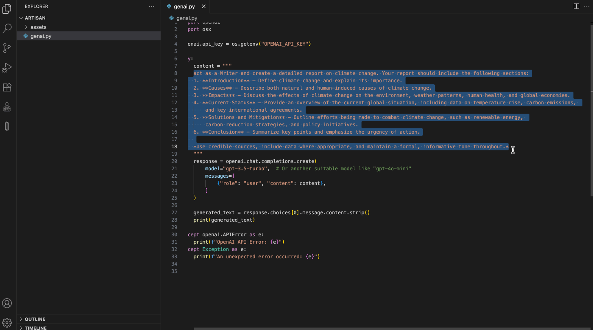

# DC Artisan

DC Artisan is a VS Code extension that provides prompt enhancement and RAG pipeline tools for developers.

## Installation

You can install DC Artisan directly from the [VS Code Marketplace](https://marketplace.visualstudio.com/items?itemName=3musketeers-br.dc-artisan).

## Features

### Prompt Enhance
- Markdown-based prompt editing
- Highlights variables in {} format, e.g., {language}, {task}
- Input test values for variables and preview the result with substitutions
- Test with various providers like ChatGPT, Claude, Gemini, etc.



### RAG Pipeline Mode
- Document Management:
  - Upload and embed new documents directly into the vector database
  - Extract text from common formats: PDF, TXT, DOCX, MD, etc.
- Embedding Operations:
  - Atomically view, update, and delete individual text chunks
  - Copy documents or namespaces without re-embedding (cost-efficient operations)
- Multi-User Features:
  - Full support for multi-user backend instances
  - Includes user/session tracking and audit logs


## Requirements

- VS Code 1.60.0 or higher
- InterSystems IRIS backend for RAG services

## Extension Settings

This extension contributes the following settings:

* `dc-artisan.defaultProvider`: Default AI provider for prompt testing
* `dc-artisan.defaultNamespace`: Default namespace for RAG operations

## Known Issues

- Initial release, please report any issues on the GitHub repository

## How to compile and package the extension

Follow these steps to compile and generate the `.vsix` file for this extension:

1. Install [Node.js](https://nodejs.org/).
2. In the terminal, navigate to the `vscode-extension` folder of the project:
   ```bash
   cd vscode-extension
   ```
3. Install the project dependencies:
   ```bash
   npm install
   ```
4. Install the `vsce` utility globally (used to package VSCode extensions):
   ```bash
   npm install -g @vscode/vsce
   ```
5. To compile the extension:
   ```bash
   npm run compile
   ```
6. To package and generate the `.vsix` file:
   ```bash
   vsce package
   ```
   The `.vsix` file will be generated in the current folder and is ready to be installed in VSCode.

## 🎖️ Credits
Artisan is developed with ❤️ by the Musketeers Team

* [José Roberto Pereira](https://community.intersystems.com/user/jos%C3%A9-roberto-pereira-0)
* [Henry Pereira](https://community.intersystems.com/user/henry-pereira)
* [Henrique Dias](https://community.intersystems.com/user/henrique-dias-2)
